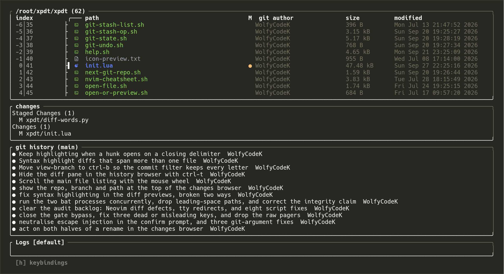
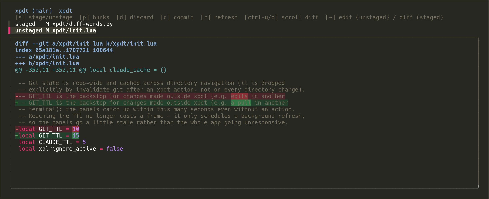
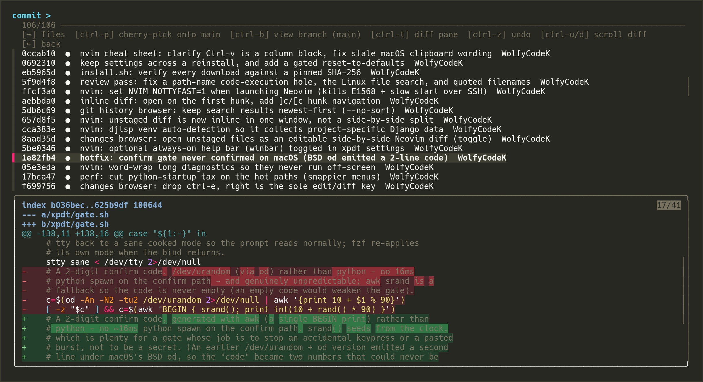

<div align="center">


# xpdt

**A keyboard-driven git client and code browser for the terminal.**

A heavily customised [xplr](https://xplr.dev) file manager with live git status,
changes, history and stash browsers, syntax-highlighted word-level diffs and a
matching Neovim config - every action is one key away, and by default every
one that changes your work asks for a two-digit code first.

[](https://github.com/WolfyCodeK/xpdt/tags)
[](https://github.com/WolfyCodeK/xpdt/commits/main)


[](LICENSE)

**[Install](#install)** · **[Keys](#keys)** · **[Settings](#settings)** · **[How it works](xpdt/README.md)**

</div>



<sub>Every screenshot is xpdt browsing its own repository, with a couple of edits in progress.</sub>

## What it does

- **Git in the file listing** — every file shows its status and the last person to change it. Beside the listing sit a live changes box and the branch's recent history, both read from a cache, so moving around never waits on git.
- **Changes browser** (`enter`) — stage or unstage whole files or single hunks, discard, and commit. Diffs are syntax highlighted, and within a changed line the exact words that differ are picked out.
- **Commit history** (`;`) — browse any local or remote branch, open a commit to go through its files, cherry-pick a commit onto the current branch, or undo the last one.
- **Stash browser** (`s`) — create, apply, pop, drop and clear stashes.
- **Search** (`/` and `\`) — find files by name, or search inside them, across the current folder or the whole repository. Symlinked folders and files are searched too.
- **File operations** — create, rename with the current name already filled in, move by fuzzy-picking the destination, and delete to the Trash.
- **Confirmation gate** — by default, anything that changes your files or your repository asks you to type a random two-digit code first, so a stray key cannot discard your work. Each action can be switched on or off in the settings.
- **Neovim to match** — `→` opens a file in Neovim, at the matching line when you came from a search. An inline diff viewer steps from change to change, and intellisense is opt-in per language, so only the servers you pick are installed.
- **Five themes** — Monokai, Gruvbox, Nord, Dracula and Tokyo Night, each recolouring xpdt, Neovim, bat and the fzf browsers together.



<sub>The changes browser. Only the words that changed light up, over the file's own syntax colours.</sub>



<sub>The commit history. The diff underneath follows the focused commit; `ctrl-t` hides it to give the list the whole screen.</sub>

## Install

You need macOS or Linux (Windows works through WSL2, below) with git, python3,
curl or wget, and a C compiler for Neovim's syntax parsers - on macOS the Xcode
command line tools provide all of them. You also need a
[Nerd Font](https://www.nerdfonts.com/) set as your terminal font so the icons
render; Hack Nerd Font is a good choice, and is what the screenshots use.
Everything else is fetched for you.

```sh
git clone https://github.com/WolfyCodeK/xpdt.git ~/.xpdt
cd ~/.xpdt
./install.sh
```

Make sure `~/.local/bin` is on your `PATH`, then run **`xpdt`**.

Keep the clone somewhere stable: the configs are symlinked out of it, so moving
or deleting it breaks them.

`install.sh` downloads pinned releases of the tools xpdt relies on into
`~/.local`, backs up any existing `~/.config/xpdt` and `~/.config/nvim`,
symlinks this repository in their place, installs the `xpdt` launcher next to
`xplr`, and installs the Neovim plugins. The config depends on recent features of
these tools, so exact versions matter:

- **xplr** — 1.1.0
- **fzf** — 0.74.0
- **bat** — 0.26.1
- **ripgrep** — 14.1.1
- **Neovim** — 0.12.4
- **tree-sitter** — 0.26.11

**Every download is checked against a pinned SHA-256 before it is used**, and a
mismatch stops the install rather than running the binary - a pinned version on
its own would not catch a swapped or tampered file, and a tool with no pinned
hash is refused outright. The ripgrep, fzf and xplr hashes were cross-checked
against the checksum files those projects publish; bat, Neovim and tree-sitter
publish none, so theirs were recorded from a verified-TLS download. Checking
needs `sha256sum`, `shasum` or `openssl`, and macOS and Linux both ship at least
one.

Options: `--prefix DIR` (or `XPDT_PREFIX`) to install somewhere other than
`~/.local`, `--tools-only`, `--config-only`, and `--no-nvim-bootstrap`.

**xpdt sits alongside stock xplr rather than replacing it.** `xpdt` runs
`xplr -c ~/.config/xpdt/init.lua`; plain `xplr` keeps its out-of-the-box
behaviour, and the installer never writes a `~/.config/xplr`. Every xplr flag
passes straight through `xpdt`, `xpdt --help` gives a one-screen summary, and
`xpdt --version` reports both, for example `xpdt 1.0.0 (xplr 1.1.0)`.

### Windows (WSL2)

xplr publishes no native Windows build and the config is POSIX shell, so xpdt
runs under [WSL2](https://learn.microsoft.com/windows/wsl/install):

```powershell
wsl --install        # first time only; reboot, then open the Ubuntu shell
```

In the Ubuntu shell, follow the steps above, and set a Nerd Font in Windows
Terminal under Settings, your profile, Appearance, Font face. If you only want
the editor, the `nvim/` config also runs on native Windows Neovim.

### Linux notes

The pinned xplr binary needs glibc 2.39 or newer (Ubuntu 24.04, Debian 13,
Fedora 39 and later). On older systems `install.sh` builds xplr 1.1.0 from source
instead when `cargo` is available ([rustup.rs](https://rustup.rs)); that build is
verified by cargo's own registry checksums rather than by the pins above.

Clipboard copy uses whichever of `pbcopy`, `wl-copy`, `xclip` or `clip.exe`
exists, and says so when there is none rather than reporting a copy that did not
happen. Delete prefers the platform's Trash - Finder, then `trash-put`, then
`gio trash` - and only falls back to an unrecoverable delete when there is no
trash tool, which the confirmation prompt tells you.

### Updating

```sh
cd ~/.xpdt && git pull && ./install.sh
```

Re-running the installer is safe: tools already at their pinned version are
skipped, and **your settings are kept** - the theme, the confirmation-gate
choices and the intellisense languages carry across, even into a fresh clone.
To go back to the defaults deliberately, use the reset row at the bottom of the
`,` settings menu, which always asks for the two-digit code.

## Keys

Press `h` inside xpdt for the full list, and `ctrl-h` for a Neovim cheat sheet.
The ones you will use most:

**Moving around**

- `↑` `↓` move, `→` opens a folder or opens a file in Neovim, `←` goes up a folder
- `'` jumps back to where you started, `w` hops to the next repository alongside this one
- `q` quits

**Opening things**

- `enter` the changes browser, `;` the commit history, `s` the stash browser
- `/` find files by name, `\` search inside files
- `g` the git menu - status, fetch, checkout and pull
- `,` settings, `h` help

**Files** - each asks for the two-digit code by default

- `a` new file, `f` new folder
- `m` rename, `M` move to a folder you pick from a fuzzy list
- `d` delete, to the Trash where the platform has one

**In the changes browser**

- `s` stage or unstage the file, `p` pick individual hunks, `d` discard, `c` commit
- `→` edit an unstaged file, or open a staged one in the inline diff viewer
- `ctrl-u` / `ctrl-d` scroll the diff, `r` refresh, `←` back

**In the commit history**

- `→` open a commit and go through its files
- `ctrl-b` view another branch, `ctrl-p` cherry-pick onto the current branch, `ctrl-z` undo the last commit
- `ctrl-t` hide or show the diff pane, `ctrl-u` / `ctrl-d` scroll it, `←` back

Every letter is free for typing in the commit list's filter, which is why its
actions are all ctrl keys.

## Settings

Press `,` to open the settings menu. Changes save as you make them; a few, such
as the theme, take effect the next time you start xpdt.

- **Confirmation gate** — a master switch, and a switch for each action that changes your files or your repository.
- **General** — show hidden files, let the mouse wheel scroll the file listing (turn it off to get plain drag-select back), a panel of Claude Code sessions in the git history box, the one-line keybindings hint, and the logs strip.
- **Neovim** — preview a file before opening it, let `←` at the start of a line return to xpdt, show a key-hint bar, and open unstaged files with their changes shown inline.
- **Theme** — Monokai (the default), Gruvbox, Nord, Dracula or Tokyo Night.
- **Git history** — how many columns wide the history box is.
- **Intellisense** — switch on the languages and frameworks you want; only their servers are installed.
- **Reset** — put everything back to the defaults.

## How it works

xpdt is three layers. [xplr](https://xplr.dev) draws the file listing and runs
the keybindings, driven by one Lua file, [`xpdt/init.lua`](xpdt/init.lua). The
browsers are [fzf](https://github.com/junegunn/fzf), launched by about fifty
small POSIX shell scripts alongside it. And every diff preview is piped through
[`diff-words.py`](xpdt/diff-words.py), which pairs up changed lines, finds the
words that differ, and lays that over [bat](https://github.com/sharkdp/bat)'s
syntax colours.

Moving around never waits on git. A background refresh writes the repository's
status and history to a small cache in `${XDG_CACHE_HOME:-~/.cache}/xpdt` and the
listing draws from that. Git is read directly in only two places, both on
purpose: the first time you enter a repository, where the alternative is an empty
panel, and straight after something xpdt does itself - a stage, a commit, a
checkout - so the next frame already shows the result. The cache is safe to
delete.

The design, the caching and every trade-off behind them are written up in
[`xpdt/README.md`](xpdt/README.md).

**Layout**

- **`install.sh`** — fetches and verifies the pinned tools, links the configs, writes the launcher
- **`xpdt/`** — the xplr config and its helper scripts, linked to `~/.config/xpdt`
- **`nvim/`** — the Neovim config, linked to `~/.config/nvim`
- **`docs/images/`** — the images in this README
- **`VERSION`** — xpdt's own version, tagged `v<version>` in git and independent of xplr's

## Credits and licence

xpdt is a personal setup built entirely on [xplr](https://github.com/sayanarijit/xplr),
the open-source terminal file manager by sayanarijit (MIT licensed) - it is
essentially a modded xplr, and would not exist without that project's Lua API.
The Neovim side is built on [lazy.nvim](https://github.com/folke/lazy.nvim),
nvim-treesitter, the [monokai.nvim](https://github.com/tanvirtin/monokai.nvim)
theme and the other plugins listed in [`nvim/init.lua`](nvim/init.lua).

Everything in this repository is released into the public domain under
[The Unlicense](LICENSE): copy it, change it and reuse it freely, with or without
credit. xplr, Neovim and the plugins keep their own licences.
